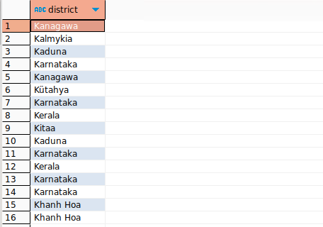

# Домашнее задание к занятию «SQL. Часть 1» - Михалёв Сергей

---

Задание можно выполнить как в любом IDE, так и в командной строке.

### Задание 1

---

Получите уникальные названия районов из таблицы с адресами, которые начинаются на “K” и заканчиваются на “a” и не содержат пробелов.

**Решение**

```
SELECT district FROM address WHERE district LIKE 'K%a';
```

- результат
  

---

### Задание 2

Получите из таблицы платежей за прокат фильмов информацию по платежам, которые выполнялись в промежуток с 15 июня 2005 года по 18 июня 2005 года **включительно** и стоимость которых превышает 10.00.

**Решение**

Так как оператор BETWEEN (x BETWEEN a AND b) является более компактной записью совокупности ((x >= a) AND (x <= b)), то использую скрипт:

```
SELECT * FROM payment WHERE (payment_date BETWEEN '2005-06-15' AND '2005-07-18') AND amount > 10;
```

- результат
  

---

### Задание 3

Получите последние пять аренд фильмов.

**Решение**

```
SELECT * FROM payment ORDER BY payment_date DESC LIMIT 5;
```

- результат
  

---

### Задание 4

Одним запросом получите активных покупателей, имена которых Kelly или Willie. 

Сформируйте вывод в результат таким образом:
- все буквы в фамилии и имени из верхнего регистра переведите в нижний регистр,
- замените буквы 'll' в именах на 'pp'.

**Решение**

Исходя из синтаксиса SQL запроса, приобразования пришлось провести до сортировки таблицы по имени покупателя:

```
SELECT customer_id, last_name, LOWER( REPLACE(first_name,'LL','PP')) FROM customer WHERE (first_name LIKE "Kelly" OR first_name LIKE "Willie");
```

- результат
  

---
